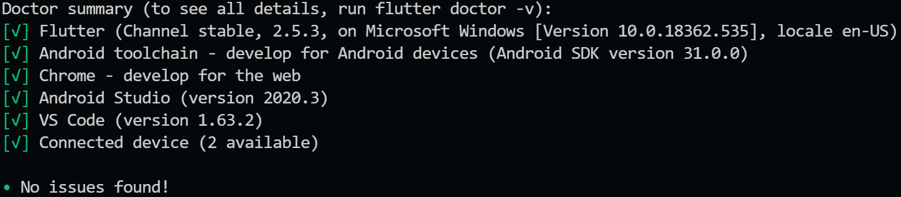

# Newsopolis

> *__Newsopolis__* es una red social enfocada en
> estudiantes de comuncación social.
> Demostracion en vivo [_aquí_](https://www.canva.com/design/DAEzIGldpBc/nRJydeGDTR1IHiU9mY80lw/watch?utm_content=DAEzIGldpBc&utm_campaign=designshare&utm_medium=link&utm_source=publishsharelink).

## Tabla de contenido

* [Información general](#información-general)
* [Tecnologías utilizadas](#tecnologías-utilizadas)
* [Features](#features)
* [Setup](#setup)
* [Uso](#uso)
* [Estado del proyecto](#estado-del-proyecto)
* [Agradecimientos](#agradecimientos)
* [Contacto](#contacto)

## Información General

* La aplicacion Newsópolis fue creada en el marco del proyecto MisionTIC 2022, un programa liderado por el gobierno de Colombia con el fin de formar jovenes y adultos colombianos en programacion para asi enfrentar los desafíos de la Cuarta Revolución Industrial.
* Mas especificamente, la aplicación fue producto del trabajo realizado como parte del ciclo 4 de MisionTIC: Enfasis en desarrollo de aplicaciones móviles dirigido por la [Universidad del Norte](https://www.uninorte.edu.co/).

### Objetivo General de la aplicacion

* Según lo estipulado en la planeación de la aplicacion: "La red social __Newsopolis__ servirá a los usuarios para publicar sus actividades y publicar contenido relacionado".
* Siendo el producto generado a partir del trabajo realizado en el ciclo, la aplicacion creada fungió como medio para el estudio y aprendizaje de:
  * Dart
  * Flutter
  * _Clean Architecture_ (enfocado hacia el desarrollo movil)

## Tecnologías Utilizadas

* Flutter - versión 2.5.3 (channel stable)
* Dart - versión 2.14.4
* Android Studio - versión 2020.3
* Firebase

## Features

* Login (con correo y  clave)
* Registro (nombre, correo, clave) se envían datos a firebase.
* Feed de estados (mediante firestore)
  * Publicaciones de estado de otros usuarios (solo texto).
  * Capacidad de hacer publicaciones propias.
* Feed de noticias (mediante firestore)
  * Publicaciones de estado de otros usuarios (solo texto).
  * Capacidad de hacer publicaciones propias.
* Chat general en tiempo real (usndo firebase en tiempo real)
* Publicar y actualizar ubicación actual del usuario
* Shared preferences (toggle night mode/day mode)

## Setup

Para poder correr la aplicacion de manera local, en su equipo es necesario instalar las tecnologias necesarias (flutter y dart) con sus versiones respectivas. Tambien vale recalcar que el Android SDK minimo para ejecutar la aplicacion es 21, pero el __target__ es 30.

### Requerimientos y dependencias

Estas se encuentran en el archivo [pubspec.yaml](https://github.com/Vhiper-JM/Newsopolis/blob/main/newsopolis/pubspec.yaml). Para instalar las dependencias listadas en el archivo, ejecute el siguiente comando sobre la carpeta _root_ del proyecto: `flutter pub get`.

### Flutter Doctor Summary

## Uso

Para poder correr la aplicacion es necesario un dispositivo android (o un emulador) con una version minima de android 5.0 (Lollipop / API level 21). Una vez el ambiente de desarrollo reconozca el dispositivo en el que desea correr el proyecto, ejectue el siguiente comando:

`flutter run`

## Estado del proyecto

A la fecha de sustentacion en la feria de proyectos de la Universidad del Norte (21/12/2021), el proyecto _**Newsopolis**_ se encuentra _finalizado_.

## Agradecimientos

* Integrantes del el equipo de desarrollo:
  * Mayra Alejandra Camacho Gama
  * Jose Miguel Mosquera Moncaleano
* Tutora directa del proyecto:
  * Shary Bustos Montenegro
* Docente encargada de la unidad:
  * Angie Valera Alarcon
* Este proyecto fue inspirado por el proyecto [red de egresados](https://github.com/EjemplosMisionTic2022/red_egresados) de la Universidad del Norte.
* Demás docentes encargados de la unidad:
  * Jose Fernandez Lopez
  * Darelys Floarian Sarmiento
  * Omar Marenco Caneppa
  * Meliza Teresa Muñoz Mendoza

## Contacto

* Mayra Alejandra Camacho Gama
  * Correo institucional - gamam@uninorte.edu.co
  * Github - [@Aleja2025](https://github.com/Aleja2025)
* Jose Miguel Mosquera Moncaleano
  * Correo institucional - moncaleanoj@uninorte.edu.co
  * Github - [@Vhiper-JM](https://github.com/Vhiper-JM)
  * Github - [@JMosqueraM](https://github.com/JMosqueraM)
